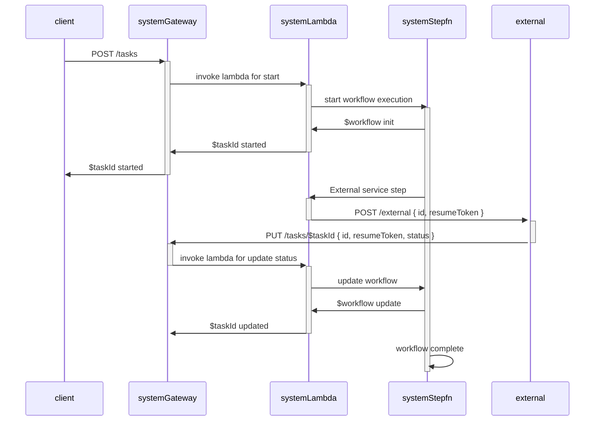

# Workflows

Experiments with AWS step functions.

## Usage

See setup and deployment instructions below.

### Workflow calling a lambda

See [Workflow Lambda](./lib/workflows-lambda.ts) for code. Explanation in [blog](https://rahulrevo.substack.com/p/tech-workflow-basics-with-aws-step).

### Workflow for idempotent tests

See [Workflow Idempotent](./lib/workflows-idempotent.ts) for code.

After deployment the API endpoints are listed as output like-

```shell
Outputs:
WorkflowIdempotentStack.WorkflowIdempotentApiEndpointXXXX = https://$api.execute-api.$region.amazonaws.com/prod/

Stack ARN:
arn:aws:cloudformation:region::stack/WorkflowIdempotentStack/id
```

Invoke using curl like

```shell
curl --request POST \
  --url https://$api.execute-api.$region.amazonaws.com/prod/workflow \
  --header 'Content-Type: application/json' \
  --data '{
	"name": "foo",
	"input": { "data": "value"}
}'
```

the name is the id to be used for the workflow execution.

### Workflow for async token pattern

[Workflow Stack](./lib/workflows-stack.ts) implements the [callback with token pattern](https://rahulrevo.substack.com/p/tech-workflow-service-integration). The flow diagram is shown below.



After deployment the API endpoints are listed as output like-

```shell
Outputs:
WorkflowsStack.ServiceApiEndpointXXXX = https://$api.execute-api.$region.amazonaws.com/prod/
WorkflowsStack.WorkflowApiEndpointYYYY = https://$apiComposite.execute-api.$region.amazonaws.com/prod/

Stack ARN:
arn:aws:cloudformation:region::stack/WorkflowsStack/id
```

#### API endpoints

| Task                           | Endpoint sample                                                                                          |
| ------------------------------ | -------------------------------------------------------------------------------------------------------- |
| Start simple workflow          | POST https://$api.execute-api.$region.amazonaws.com/prod/workflows                                       |
| Get simple workflow results    | GET https://$api.execute-api.$region.amazonaws.com/prod/workflows/$workflowId                            |
| Start composite workflow       | POST https://$apiComposite.execute-api.$region.amazonaws.com/prod/compositeWorkflows                     |
| Get composite workflow results | GET https://$apiComposite.execute-api.$region.amazonaws.com/prod/compositeWorkflows/$compositeWorkflowId |

## Deployment

### Tooling setup

This project is based on [AWS CDK](https://docs.aws.amazon.com/cdk/v2/guide/home.html)
in [typescript](https://docs.aws.amazon.com/cdk/v2/guide/work-with-cdk-typescript.html). Follow the steps
in [getting started](https://docs.aws.amazon.com/cdk/v2/guide/getting_started.html) for-

- aws account setup with credentials
- cdk cli installation (v2)
- cdk bootstrapping

### Project commands

| Task                 | Command           |
| -------------------- | ----------------- |
| install npm packages | `npm install`     |
| build                | `npm run build`   |
| deploy to aws        | `cdk deploy -all` |
| destroy app          | `cdk destroy`     |
